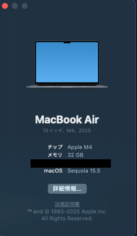

# 概要

Kubernetesを学習したいけれど、「Hello World」レベルのサンプルでは物足りない...そんな方に向けた実践的なチュートリアルです。

本記事では、**React（フロントエンド）+ Node.js/Express（バックエンド）+ PostgreSQL（データベース）** を組み合わせた本格的なフルスタックWebアプリケーションを、Kubernetesクラスター上に構築する手順を詳しく解説します。

## 🎯 この記事で学べること

- Kubernetesの基本概念（Pod、Deployment、Service、ConfigMap、PersistentVolume）
- マイクロサービス間の通信設定
- Nginxを使ったリバースプロキシ設定
- データベースの永続化
- 実際の開発で遭遇するトラブルシューティング

## 🏗️ 構築するアプリケーション

シンプルなユーザー管理システムを構築します：

- **フロントエンド**: Reactでユーザー一覧を表示
- **バックエンド**: Express APIでユーザーデータを提供
- **データベース**: PostgreSQLでユーザー情報を永続化


## 📁 GitHubリポジトリ

完全なソースコードはこちらで公開しています：

**🔗 [kubernetes-webapp-tutorial](https://github.com/kazukifukuyama14/kubernetes-webapp-tutorial)**

```bash
git clone https://github.com/kazukifukuyama14/kubernetes-webapp-tutorial.git
```

## 📋 前提条件

### 必要なツール

以下のツールが事前にインストールされている必要があります：

| ツール             | バージョン | 用途                   |
| ------------------ | ---------- | ---------------------- |
| **Docker Desktop** | 最新版     | コンテナ実行環境       |
| **Minikube**       | v1.25+     | ローカルKubernetes環境 |
| **kubectl**        | 最新版     | Kubernetesクライアント |
| **Git**            | 最新版     | ソースコード管理       |

### インストール確認

```bash
# バージョン確認コマンド
docker --version
minikube version
kubectl version --client
git --version
```

### 推奨スペック

- **メモリ**: 8GB以上
- **CPU**: 4コア以上
- **ディスク容量**: 10GB以上の空き容量

### 参考:著者のスペック



:::message
**初心者の方へ**
KubernetesやDockerの基本概念について不安な方は、まず公式ドキュメントの入門セクションを一読することをお勧めします。  
ただし、本記事では実際の手順を詳しく解説するため、基本的な知識がなくても進められるよう配慮しています。
:::

## 🏛️ アーキテクチャ概要

今回構築するシステムの全体像：

```bash
[ブラウザ]
    ↓ HTTP
[Minikube Service]
    ↓
[Frontend Pod (React + Nginx)]
    ↓ /api/* → プロキシ
[Backend Pod (Node.js/Express)]
    ↓ SQL
[PostgreSQL Pod]
    ↓
[Persistent Volume]
```

それでは、実際に構築を始めていきましょう！🚀

## 🏗️ システム構成の詳細解説

### 各コンポーネントの役割

#### フロントエンド層

- **React + Nginx**: 静的ファイル配信 + `/api/*` のリバースプロキシ
- **レプリカ数**: 2Pod構成でロードバランシング

#### バックエンド層

- **Node.js/Express**: `/api/users` エンドポイントでREST API提供
- **レプリカ数**: 2Pod構成で高可用性確保

#### データベース層

- **PostgreSQL**: PersistentVolumeでデータ永続化
- **初期データ**: ConfigMapでサンプルユーザー4名を自動投入

### 通信の流れ

1. ブラウザ → NodePort(30080) → Frontend Service → Frontend Pod
2. Frontend Nginx → `/api/*` プロキシ → Backend Service → Backend Pod
3. Backend → PostgreSQL Service → データ取得・返却

---

## 🚀 ステップバイステップ構築手順

### Step 1: 環境準備

```bash
git clone https://github.com/kazukifukuyama14/kubernetes-webapp-tutorial.git
cd kubernetes-webapp-tutorial

# Minikube起動（メモリ4GB必須）
minikube start --driver=docker --memory=4096 --cpus=2
```

### Step 2: Docker環境の切り替え

```bash
# 重要：Minikube内のDocker環境に切り替え
eval $(minikube docker-env)
```

:::message alert
この手順を忘れると後で `ErrImageNeverPull` エラーが発生します！
:::

### Step 3: アプリケーションイメージのビルド

```bash
# バックエンドイメージ（Node.js/Express）
docker build -t webapp-backend:latest ./backend

# フロントエンドイメージ（React + Nginx）
docker build -t webapp-frontend:latest ./frontend
```

**重要なポイント**:

- `backend/Dockerfile`: Node.js 18-alpine、ポート3001公開
- `frontend/Dockerfile`: マルチステージビルド（build → nginx）
- `frontend/nginx.conf`: `/api/*` → `http://webapp-backend-service:3001/api/*` プロキシ設定

### Step 4: Kubernetesリソースのデプロイ

```bash
# データベース（PostgreSQL + PersistentVolume）
kubectl apply -f k8s/postgres-deployment.yml
kubectl apply -f k8s/postgres-service.yml

# 設定情報（DB接続情報 + 初期SQLデータ）
kubectl apply -f k8s/configmap.yml

# バックエンド（Node.js API サーバー）
kubectl apply -f k8s/backend-deployment.yml
kubectl apply -f k8s/backend-service.yml

# フロントエンド（React + Nginx）
kubectl apply -f k8s/frontend-deployment.yml
kubectl apply -f k8s/frontend-service.yml
```

**設定のポイント**:

- `imagePullPolicy: Never`: ローカルビルドイメージを使用
- `envFrom: configMapRef`: 環境変数をConfigMapから注入
- `NodePort: 30080`: 外部アクセス用ポート

### Step 5: アプリケーションへのアクセス

```bash
# ブラウザが自動で開く
minikube service webapp-frontend-service
```

---

## 🔥 実際に躓いた箇所とその解決法

### 1. `ErrImageNeverPull` エラー

**症状**: Podが `ErrImageNeverPull` 状態で起動しない

**原因**: MinikubeのDocker環境でイメージがビルドされていない

**解決方法**:

```bash
# Minikube Docker環境に切り替え（最重要！）
eval $(minikube docker-env)

# イメージ再ビルド
docker build -t webapp-backend:latest ./backend
docker build -t webapp-frontend:latest ./frontend

# 確認
docker images | grep webapp
```

:::message
**学習ポイント**: MinikubeはローカルDockerとは別環境。必ず `eval $(minikube docker-env)` で切り替えが必要！
:::

### 2. Nginx設定が反映されない問題

**症状**: nginx.conf変更後もPod内設定が古いまま

**原因**: Dockerビルドキャッシュが原因

**解決方法**:

```bash
# キャッシュ完全クリア
docker system prune -a -f

# キャッシュなし再ビルド
docker build --no-cache -t webapp-frontend:latest ./frontend

# デプロイメント再作成
kubectl delete deployment webapp-frontend-deployment
kubectl apply -f k8s/frontend-deployment.yml
```

### 3. APIプロキシパスの設定ミス

**症状**: `/api/users` アクセス時に404エラー

**原因**: nginx.confのproxy_pass設定ミス

**重要な設定**:

```nginx
# ❌ 間違い：/api/が削除される
proxy_pass http://webapp-backend-service:3001/;

# ✅ 正解：/api/が保持される
proxy_pass http://webapp-backend-service:3001/api/;
```

### 4. Pod間通信の名前解決

**ポイント**: Kubernetes内ではService名で名前解決

```javascript
// ❌ IPアドレス直指定
const dbHost = "192.168.1.100";

// ✅ Service名で指定
const dbHost = process.env.DB_HOST; // 'postgres-service'
```

### 5. データベース初期化のタイミング

**解決方法**: PostgreSQL起動完了を待機

```bash
# 起動完了まで待機
kubectl wait --for=condition=ready pod -l app=postgres --timeout=300s

# ログで初期化確認
kubectl logs -l app=postgres
```

---

## 🔍 動作確認とデバッグ

### 基本確認コマンド

```bash
# Pod状態確認（全てRunning状態が理想）
kubectl get pods

# サービス確認
kubectl get services

# ログ確認
kubectl logs -l app=webapp-backend
kubectl logs -l app=webapp-frontend
kubectl logs -l app=postgres
```

### API動作テスト

```bash
# バックエンドAPI直接テスト
kubectl exec -it $(kubectl get pods -l app=webapp-frontend -o jsonpath='{.items[0].metadata.name}') -- curl http://webapp-backend-service:3001/api/users

# プロキシ経由テスト
kubectl exec -it $(kubectl get pods -l app=webapp-frontend -o jsonpath='{.items[0].metadata.name}') -- curl http://localhost/api/users
```

---

## 🎯 学習ポイントまとめ

### Kubernetesの実践知識

| 概念                 | 学習内容                       |
| -------------------- | ------------------------------ |
| **Pod**              | アプリケーションの最小実行単位 |
| **Deployment**       | Podの管理・レプリカ制御        |
| **Service**          | Pod間通信・ロードバランシング  |
| **ConfigMap**        | 設定情報の外部化・環境変数注入 |
| **PersistentVolume** | データ永続化・Pod再起動対応    |

### 実践で重要だった事項

1. **環境切り替え**: `eval $(minikube docker-env)` の重要性
2. **名前解決**: Service名による内部通信
3. **設定管理**: ConfigMapでの環境変数管理
4. **デバッグ**: `kubectl logs` と `kubectl exec` の活用
5. **キャッシュ管理**: Docker build cache の注意点

---

## 🧹 クリーンアップ

```bash
# 全リソース削除
kubectl delete -f k8s/

# Minikube停止・削除
minikube stop
minikube delete
```

---

この実践チュートリアルを通じて、Kubernetesの基本から実際の運用で遭遇する問題まで体験できました。  
完全なソースコードは [GitHubリポジトリ](https://github.com/kazukifukuyama14/kubernetes-webapp-tutorial) で確認できます！🚀
